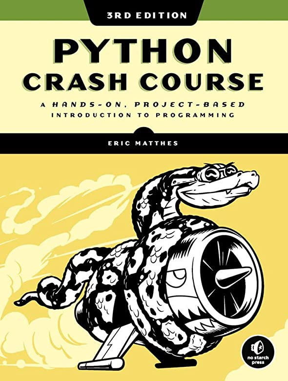

# 'U.F.O. 77'

### Project description:
A tiny game 'U.F.O. 77'. I love to create a small computer games for the white collar workers and "UFO" was planned as a small game in 1970-th style.
The project is based on the **"Python crash course"** book by **E.Matthes** with some additional features. Images and sounds are taken from the Internet, I have just added minor changes.

### Project inspirer:

### Project technologies:

> Python 3 (I used Python 3.9)

 
> Pygame

### How to play:
The goal is to destroy the alien invaders fleet before enemy ships reach you.

- press "O" to start the game
- press "P" to pause and "C" to continue the game
- press "SPACE" to fire bullets
- press "R" to fire rockets (only 12 allowed per tour)
